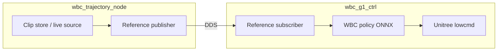

# Architecture

## Today: monolithic controller

`wbc_g1_ctrl` on the G1 onboard PC:

1. **FSM** — Passive / FixStand / Wbc_Tracking  
2. **Policy** — ONNX in `config/policy/wbc/params/`  
3. **Clips** — NPZ library in `config/clips/`  
4. **Reference** — WBC command vector + `q_ref` from active clip @ 50 Hz  

## Planned: two DDS nodes

### `wbc_trajectory_node` (future, separate package)

- Playback index, loop, clip catalog  
- Publishes `wbc_command` (39-d for G1), joint references, optional anchor pose  
- Accepts clip-select commands (joystick relay or operator UI)  

### `wbc_g1_ctrl` (this repo)

- Subscribes when `reference_source: dds`  
- Same ONNX + PD; FSM unchanged  

### Draft DDS topics

| Topic | Content |
|-------|---------|
| `wbc/ref/command` | Float32[39] reference command |
| `wbc/ref/joint_pos` | Float32[29] |
| `wbc/ref/meta` | time, frame, clip_name |
| `wbc/cmd/clip` | next / prev / select |

## Migration

1. **Now** — `MotionClipLibrary` + local NPZ  
2. **Next** — optional DDS reference in deploy.yaml  
3. **Later** — trajectory node owns motion; controller subscribes only  
