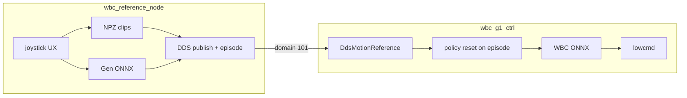

# Architecture

## Processes



| Process | Role |
|---------|------|
| **`wbc_reference_node`** | **All** user interaction: browse/play clips, getup/liedown, Gen teleop |
| **`wbc_g1_ctrl`** | FSM (Passive/FixStand/FloorReady/Wbc) + WBC ONNX tracking of DDS Arc |

Set `reference_source: dds` (default). Legacy `clips` keeps in-ctrl library for single-process bring-up.

## Sync

Each time the reference node **starts a clip** or **enters Gen**, it bumps an `episode` id in DDS meta. Ctrl calls `env->reset()` so policy history starts with that reference.

While idle in clip-select, the node keeps publishing the frozen frame (episode unchanged) — ctrl holds that pose.

## Joystick (reference node only)

| Input | Action |
|-------|--------|
| `RT + left/right` | Browse clips |
| `A` | Play selected clip |
| `sticks` | **Gen:** cruise velocity |
| `RT` (hold) | **Gen sprint:** height → `sprint_height`; cruise × `sprint_vel_mult` |
| `RB` (hold) | **Gen crouch:** height → `crouch_height`; cruise × `crouch_vel_mult` (overrides sprint) |
| `RT + up` | **Down:** play getup |
| `RT + down` | **Standing:** play liedown |
| `RT + Y` | Enter **Gen** |
| `RT + X` | Return to **clip select** |

Walk / sprint / crouch each set torso height + `*_vel_mult` on shared cruise limits (crouch > sprint > walk).

Ctrl FSM (motors only): FixStand / FloorReady / Passive / enter Wbc_Tracking.
Policy enable is always **RT+A** from FixStand or FloorReady.

Prep on the reference node mirrors Passive (same buttons):

| Input | Reference hold |
|-------|----------------|
| `LT + up` | Stand: first idle frame 0 (blocked while down) |
| `LT + down` | Down: getup frame 0 only |

**Floor / after liedown (`BodyState::Down`):**
1. `LT+down` → FloorReady + ref **Down** (publishes getup frame 0).
2. `RT+A` → enable WBC only (tracks getup frame 0; does **not** start getup).
3. `RT+up` → play getup → **Standing** → Gen / browse unlocked.

**Stand start:** `LT+up` → FixStand → `RT+A` (tracks idle). No getup gate.

Boot default is `reference_node.initial_up` (true → stand hold, false → floor hold).

Operator recipes: [`operator.md`](operator.md).

## Bring-up

```bash
# reference_source: dds
./build/wbc_reference_node -n eth0
./build/wbc_g1_ctrl -n eth0
```

## Migration

1–5. ~~Export / DDS / clips / Gen / mode switch~~  
6. ~~Ref node owns UX; ctrl pure DDS + episode sync~~  
7. **Phase F** — CPU pinning / latency  
