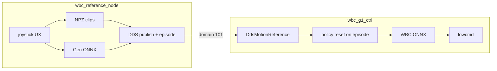

# Architecture

## Processes



| Process | Role |
|---------|------|
| **`wbc_reference_node`** | **All** user interaction: browse/play clips, getup/liedown, Gen teleop |
| **`wbc_g1_ctrl`** | FSM (Passive/FixStand/FloorReady/Wbc) + WBC ONNX tracking of DDS Arc |

Set `reference_source: dds` (default). Legacy `clips` keeps in-ctrl library for single-process bring-up.

## Sync

Each time the reference node **starts a clip** or **enters Gen**, it bumps an `episode` id in DDS meta. Ctrl calls `env->reset()` so policy history starts with that reference.

While idle in clip-select, the node keeps publishing the frozen frame (episode unchanged) — ctrl holds that pose.

## Joystick (reference node only)

| Input | Action |
|-------|--------|
| `RT + left/right` | Browse clips |
| `A` | Play selected clip |
| `sticks` | **Gen:** cruise velocity (default vx ∈ `[-0.7, 1]`) |
| `RT` (hold) | **Gen:** multiply vx/vy/ωz by `lerp(1, 2.5, RT)`, clamp to `play_vel_ranges` |
| `up` / `down` | **Clips:** getup / liedown · **Gen:** raise / lower height setpoint |
| `RB + Y` | **Gen:** reset height to idle stand (**0.80 m**) |
| `RT + Y` | Enter **Gen** |
| `RT + X` | Return to **clip select** |

Cruise / boost: `reference_node.cruise_lin_vel_*`, `vel_boost_min` / `vel_boost_max`. Height: `play_vel_ranges.height` + `height_step`. Unitree wireless R2 is mostly digital, so RT boost is often near on/off.

Ctrl FSM (motors only): FixStand / FloorReady / Passive / enter Wbc_Tracking.

After FloorReady → WBC, set `reference_node.initial_up: false` (or press getup) so the ref node plays getup before Gen.

## Bring-up

```bash
# reference_source: dds
./build/wbc_reference_node -n eth0
./build/wbc_g1_ctrl -n eth0
```

## Migration

1–5. ~~Export / DDS / clips / Gen / mode switch~~  
6. ~~Ref node owns UX; ctrl pure DDS + episode sync~~  
7. **Phase F** — CPU pinning / latency  
